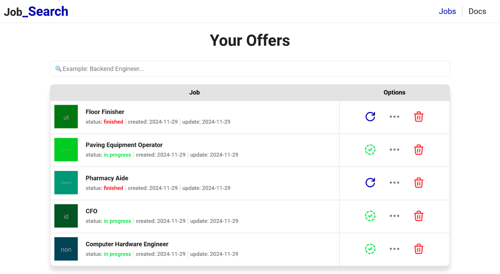
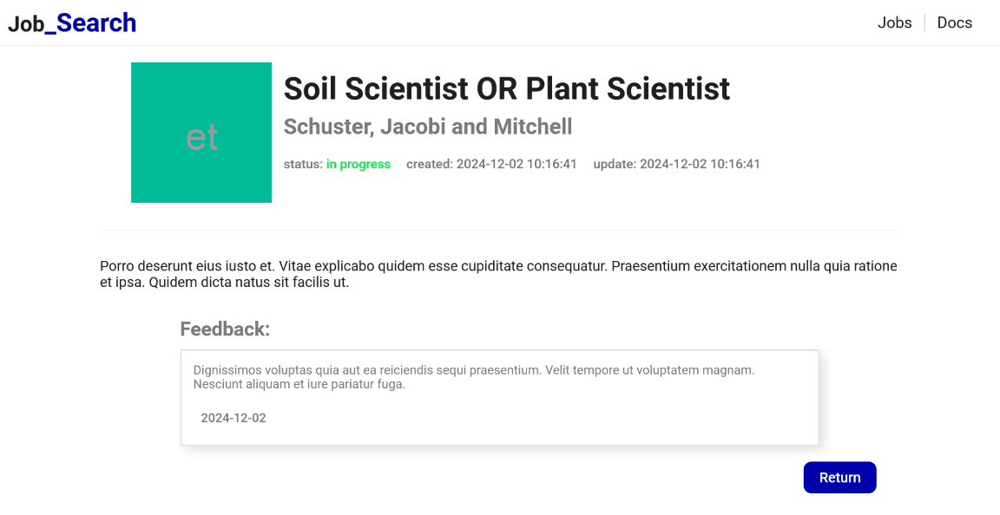
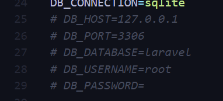
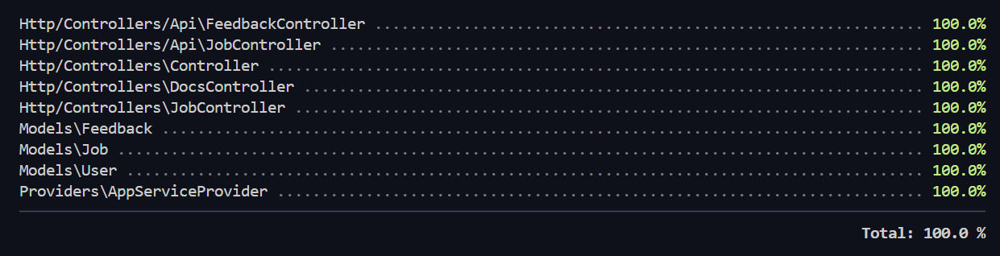
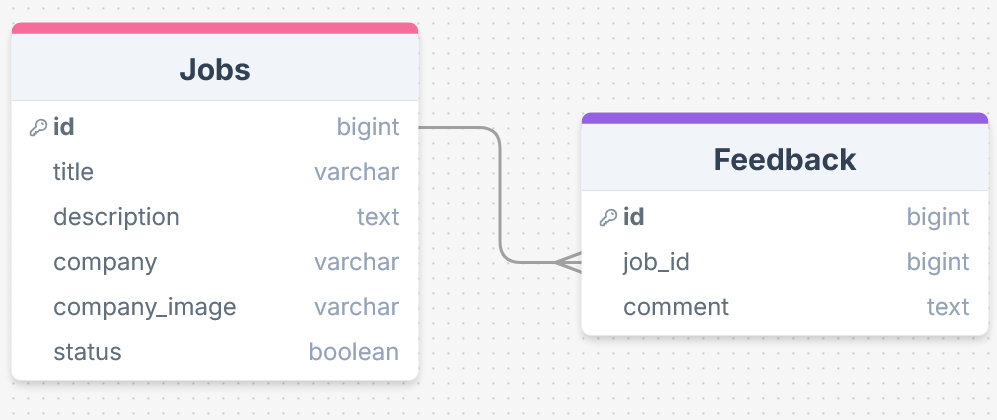

<<<<<<< HEAD
# Job_search
=======
# Job Search


## About

Job search is the newest solution for tracking job offers you are interested in. The website provides a handful of tools to manage each offer in a unique way, allowing total liberty and control to the user.

### Characeristics

* A Homepage where you can visualize all the applied offers with their current status and available options.
* A search bar to filter offers with the desired characteristics.
* View full details of an offer and keep a constant track by adding notes when needed.
* API to manage offers more easily.




## installation

### Pre-requisites

* PHP 8.0 or above
* Composer
* Relational database engine (Mysql/Sqlite)
* Node.js

### Steps

1. Clone the git repository:

```
git clone https://github.com/DinGo21/Job_search
```

2. Enter inside the folder and install all dependencies by running the next command:

```
composer install && npm install
```

3. Copy and paste the '.env.example' file and rename it to '.env', then uncomment the lines ranging from 25 to 29.



4. Change the variable `DB_CONNECTION` to the database engine you are currently using, and also name your main database inside `DB_DATABASE`.

5. generate the encryption key to get access to the database:

```
php artisan key:generate
```

6. Migrate the database and tables:

```
php artisan migrate
```

7. Last thing is to initialize the server to begin using the website by running the line below:

```
npm run build && composer run dev
```

## Using The API

The Application comes with its own API in order to manage your job offers in whatever way you want. Here you can see all the available endpoints and methods:

### Offers

>/api/jobs

**Methods**: GET, POST.

>/api/jobs/{jobId}

**Methods**: GET, PUT, DELETE.

### Feedback

>/api/jobs/{jobId}/comments

**Methods**: GET, POST.

>/api/jobs/{jobId}/comments/{commentId}

**Methods**: GET, PUT, DELETE.

## Test the Applications

Test the application stability by running the command below:

```
php artisan test --coverage
```



## BBDD Diagram



## Languages and Tools Used

<div align="left">
  
  
  
  
  
  
  
  
  
  
  
  
  
</div>


## Authors

* Diego Santamaria: 

<div align="left">
  <a href="www.linkedin.com/in/diegosm21" target="_blank">
    
  </a>
</div>
>>>>>>> 5e39635bb39b3718e27ed99a2a7e27de1c1dc115
